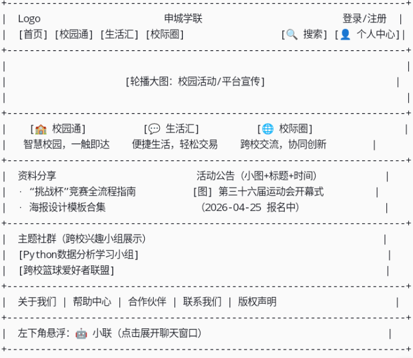
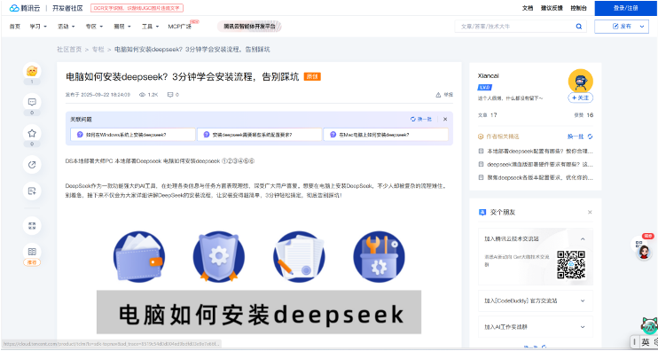
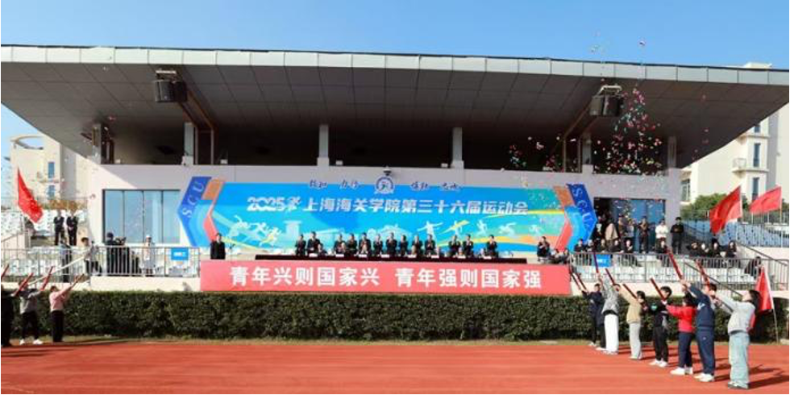
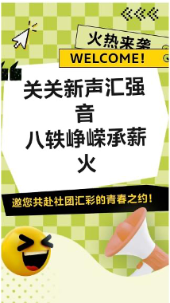
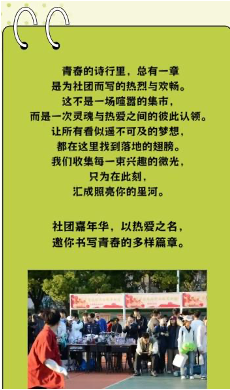

页面配色：浅蓝色和白色   logo一周后完成提供
具体页面设计参照： 

导航栏布局示例：

上方大图：

AI聊天机器人放到页面左下，可爱风格，名字叫小联

主页
资料分享（测试内容）
· 测试内容1
“挑战杯”全国大学生创业计划竞赛全流程指南（2026版）
类型：PDF文档
下载量：1247次
简介：涵盖选题、组队、申报、答辩全环节，附往届获奖案例。
· 测试内容2
校园活动海报设计模板合集（PS/AI/Canva）
类型：压缩包（含10套模板）
下载量：892次
简介：适用于招新、讲座、比赛等场景，附使用教程。

活动公告（测试内容）
第三十六届申城高校联合运动会开幕式暨田径项目报名启动
· 时间：2026年4月25日 9:00（开幕式）
· 地点：上海海关学院体育场
· 状态：可报名（田径项目）
· 简介：本届运动会由上海海关学院主办，共设12个大项，覆盖30余所高校。开幕式将邀请校领导致辞，并设有文化展演环节。田径项目现已开放报名，个人及团体均可通过“校园通-活动公告”板块提交申请。

主题社群（测试内容）
· 测试内容1
“Python数据分析学习小组”（标签：编程、数据科学）
成员：127人（来自8所高校）
近期话题：爬虫实战、数据可视化案例分享。
· 测试内容2
“跨校篮球爱好者联盟”（标签：体育、运动）
成员：89人
活动：每周组织线上战术讨论，每月一场友谊赛。

点击首页这三大板块的测试内容后可直接进入三大核心功能板块的对应功能栏网页下

申城学联项目三大核心功能
1.校园通:包括:（1）活动公告（分为两个部分，第一个部分是所有公告展示，第二个是精准推送即在每个用户进入平台之前，进行标签匹配，为每个用户精准画像，形成基于内容的推荐系统）；（2）部门协作（学校多个部门协同，简化工作流程，提升效率）；（3）场馆预约；（4）资料分享（公开一些优质资源，比如竞赛流程注意事项，ppt模板及制作一些如海报等需要用的的工具这些推文等，此功能允许所有用户编辑）；（5）校园贴士（如每个自习室关闭时间，抢课推荐，大一新生注意事项等，此功能允许所有用户编辑）这五个功能
2.生活汇:包括（1）二手交易；（2）外卖代取；（3）文创交易；（4）失物招领；（5）兼职平台（两个板块，第一个板块是家教平台，第二个板块是技能变现（如ps接单，剪辑接单，ppt制作接单等），进入这个板块儿后分为两个部分，一部分是校内供需对接，另一部分直接接入相关平台（如猪八戒））。这五个功能
3.校际圈:包括:（1）主题社群（根据每位用户选择的标签精准匹配，进行推荐，也可进行搜索，将不同高校的学生聚集）；（2）跨校项目协作（实现项目需求人才，跨校精准匹配）；（3）跨校私聊（匿名化进行（聊天匹配后，用户可自行协商添加联系方式），0成本社交）这三个功能。

“校园通”、“生活汇”、“校际圈”三大模块各功能的测试内容示例：
校园通 功能测试内容
1. 活动公告
· 测试内容1

第三十六届申城高校联合运动会开幕式暨田径项目报名启动
· 时间：2026年4月25日 9:00（开幕式）
· 地点：上海海关学院体育场
· 状态：可报名（田径项目）
· 简介：本届运动会由上海海关学院主办，共设12个大项，覆盖30余所高校。开幕			式将邀请校领导致辞，并设有文化展演环节。田径项目现已开放报名，个人及			团体均可通过“校园通-活动公告”板块提交申请。
· 测试内容2

“智慧校园”系列讲座：人工智能在校园中的应用
时间：2026年3月20日 14:00
地点：申城大学报告厅 & 线上直播
状态：可报名
简介：邀请行业专家分享AI技术在校园管理、学习辅助中的实践案例。
2. 部门协作
· 测试内容1
学工部与后勤处联合推进“校园安全月”线上协作项目
进度：进行中（已完成任务12/20）
参与部门：学工部、后勤处、保卫处、各院系辅导员
简介：通过平台实现任务分发、进度同步、文件共享，提升跨部门协作效率。
3. 场馆预约
· 测试内容1
体育馆场地预约
可预约时间：2026年3月10日 9:00-21:00（每小时一场）
状态：可预约
规则：每人每周最多预约3小时，支持提前7天预约。
· 测试内容2
多媒体报告厅团队项目答辩预约
可预约时间：2026年3月12日 - 3月15日
状态：部分时段已约满
设施：投影、话筒、录播设备，容纳100人。
4. 资料分享
· 测试内容1
“挑战杯”全国大学生创业计划竞赛全流程指南（2026版）
类型：PDF文档
下载量：1247次
简介：涵盖选题、组队、申报、答辩全环节，附往届获奖案例。
· 测试内容2
校园活动海报设计模板合集（PS/AI/Canva）
类型：压缩包（含10套模板）
下载量：892次
简介：适用于招新、讲座、比赛等场景，附使用教程。
5. 校园贴士
· 测试内容1
各校区自习室开放时间汇总（2026春季学期）
编辑者：学生事务部
最后更新：2026年2月10日
内容：包含图书馆、教学楼、通宵自习室等开放时间及预约方式。
· 测试内容2
大一新生选课避坑指南（学生共创版）
编辑者：多位高年级学生
最后更新：2026年2月8日
内容：课程难度评价、教师风格、考核方式等真实反馈。
生活汇 功能测试内容
1. 二手交易
· 测试内容1
出售：九成新《管理学》教材
价格：30元
校区：上海海关学院
状态：待交易
描述：无笔记，保存完好，支持线下交易或快递。
· 测试内容2
求购：二手自行车（女式，轻便型）
预算：200元内
校区：上海海关学院
状态：求购中
描述：希望车况良好，代步用。
2. 外卖代取
· 测试内容1
代取：北门“咖啡先生”订单（2杯拿铁）
酬金：3元
取餐点：北门咖啡店
送至：宿舍楼7号楼
状态：待接单。
· 测试内容2
发布：南门“美食广场”代取（长期合作）
酬金：5元/次
要求：每天中午12点左右取餐，需连续一周。
状态：已接单。
3. 文创交易
· 测试内容1
申城学联2026限定款帆布包（原创设计）
价格：45元
库存：32个
设计元素：学联logo、校园地标插画。
· 测试内容2
定制校园明信片套装（12张/套）
价格：20元
支持：个性化寄语、套色印章。
状态：热销中。
4. 失物招领
· 测试内容1
捡到：黑色华为耳机（图书馆三楼阅览室）
时间：2026年3月5日
招领处：图书馆服务台
状态：待认领。
· 测试内容2
寻找：学生卡（姓名：李明，学号：20261023）
丢失地点：食堂附近
联系方式：平台内私信
状态：已找回。
5. 兼职平台
· 测试内容1（家教板块）
高一数学家教（线上，每周2次）
薪资：120元/小时
要求：数学相关专业，有辅导经验。
状态：招募中。
· 测试内容2（技能变现板块）
PPT定制设计（毕业答辩模板）
预算：200-500元/套
要求：风格专业、动画流畅，3天内交付。
状态：已对接。
校际圈 功能测试内容
1. 主题社群
· 测试内容1
“Python数据分析学习小组”（标签：编程、数据科学）
成员：127人（来自8所高校）
近期话题：爬虫实战、数据可视化案例分享。
· 测试内容2
“跨校篮球爱好者联盟”（标签：体育、运动）
成员：89人
活动：每周组织线上战术讨论，每月一场友谊赛。
2. 跨校项目协作
· 测试内容1
“校园碳中和”调研项目招募团队成员
需求：环境专业2人、数据可视化1人、文案1人。
进度：筹备阶段
协作工具：平台内建任务看板、文档协作。
· 测试内容2
“乡村振兴”暑期社会实践项目（已组队）
团队：来自3所高校的6名成员
当前任务：问卷设计、实地联络。
进度：进行中。
3. 跨校私聊
· 测试内容1
匿名匹配对话（标签：考研、跨专业）
对话摘要：交流跨专业考研准备心得，分享资料。
状态：已结束（双方选择不公开联系方式）。
· 测试内容2
匿名匹配对话（标签：创业、寻找技术合伙人）
对话摘要：讨论项目idea，初步达成合作意向。
状态：已交换微信，进一步沟通中。

前端用户核心任务 (使用与创造)
用户在平台的核心任务是消费信息、创造内容、完成交易、参与协作。
· 校园通：浏览/报名公告，上传并分享学习资料/攻略推文，查阅并编辑（Wiki式）校园贴士。
· 生活汇：发布并交易二手物品、文创商品，发布/承接外卖代取需求，发布失物招领与寻物启事，发布/应聘兼职与技能服务。
· 校际圈：创建/加入兴趣社群并参与讨论，发起/申请加入跨校协作项目，通过匿名匹配发起私聊。
· 个人中心：管理所有自主发布的内容、交易订单及项目协作。
· AI助手“小联”：通过自然对话查询信息、获取服务推荐或流程指导。
后端管理者核心任务 (监管与维护)
管理员通过独立后台确保平台内容合规、生态健康、数据有序。
· 内容审核与治理：审核用户提交的所有推文、贴士、商品、项目等信息，处理举报，删除违规内容并处置相关用户。
· 平台运营与维护：发布官方公告，配置首页推荐位，管理学校、社团、场馆等基础数据。
· 数据监控与分析：监控核心数据面板（用户活跃、交易量、内容增长），进行运营决策。
· 权限与安全：管理管理员及特殊用户（如社团负责人）的权限。
AI助手“小联”核心任务 (赋能与连接)
作为智能中枢，“小联”需理解需求、激活服务、提供洞察。
· 智能问答：回答关于平台与校园的各类问题
· 个性化推荐与匹配：基于用户画像，推荐可能感兴趣的内容、社群或合作伙伴。
· 流程自动化辅助：理解用户意图（如“想预约明晚的体育馆”），引导或辅助完成复杂流程。
· 成长数据分析与洞察：分析用户行为数据，提供简洁的成长趋势反馈与建议。

各部分开发细节参考（具体使用技术只提供参考，不必一致，最后效果能实现即可）
一、 系统整体架构
采用前后端分离的架构，便于团队协作与独立部署。
1. 前端（用户侧）：
· 技术栈：Vue.js 3 + Uni-app（一套代码，同时生成微信小程序、H5网页及未来App）。
· 核心页面：首页、校园通、生活汇、校际圈、个人中心。
· 全局组件：顶部导航栏、页脚、AI助手“小联”（浮动于左下角的WebSocket聊天组件）。
2. 前端（管理侧）：
· 技术栈：Vue.js 3 + Element Plus。
· 核心模块：内容审核中心、用户管理、数据看板、公告/活动发布、交易监控。
3. 后端：
· 技术栈：Spring Boot 2.x + MyBatis-Plus + Spring Security。
· 核心服务：用户服务、内容服务、交易服务、匹配服务、AI对话服务、文件服务。
4. 数据库：
· 主库：MySQL 8.0（存储用户、商品、帖子等核心关系型数据）。
· 缓存：Redis（存储会话、热点数据、推荐列表）。
· 文件存储：阿里云OSS（存储用户上传的图片、文档）。
5. AI服务（核心）：
· 部署：独立服务或集成于后端。
· 技术：Python + FastAPI，结合大语言模型（LLM）API（如国内合规的商用API）与检索增强生成（RAG）技术。
· 知识库：将平台规则、校园信息、优质资料等向量化存储，供“小联”检索调用。
二、 核心页面流程与功能实现（编程级表述）
1. 用户端-首页 (/index)
· 布局：如上图所示，为信息聚合页。
· 组件与接口：
· Banner轮播图组件：调用 GET /api/banner 获取可配置的活动宣传图。
· 资讯列表组件：调用 GET /api/articles?type=hot&limit=3 获取热门资讯。
· 活动公告组件：调用 GET /api/activities?status=open&limit=3 获取可报名活动。
· 组织风采组件：调用 GET /api/organizations/highlight?limit=3 获取推荐社团/部门。
· “小联”初始化：页面加载后，WebSocket连接至 ws://your-domain.com/ws/assistant。发送用户上下文（如ID），以备个性化服务。
2. 用户端-校园通 (/campus)
· 布局：顶部为五个功能入口的图标导航区，下方为动态内容区。
· 核心功能实现：
· 活动公告：
· 全部公告：GET /api/announcements?category=all。
· 精准推送：用户登录后，后端根据其标签与行为，实时计算推荐列表 GET /api/announcements/recommended。
· 画像更新：用户每次浏览、点击、报名行为，触发 POST /api/user/behavior 记录，用于更新用户画像。
· 部门协作：
· 流程引擎：创建“协作事务”，定义步骤、负责人。使用 WebSocket 或站内信通知下一步负责人。
· 接口：POST /api/collaboration/task (创建)，GET /api/collaboration/my-tasks (我的任务)。
· 场馆预约：
· 状态查询：GET /api/venues/availability?date=2024-05-20。
· 预约与冲突检测：POST /api/reservations (请求体包含时间、场馆ID)。
· 资料分享：类似论坛发帖，POST /api/materials 上传文件（OSS），支持标签分类。
· 校园贴士：GET /api/tips 获取列表，支持 POST /api/tips (用户贡献)，但提交后状态为“待审核”。
3. 用户端-生活汇 (/market)
· 布局：顶部为分类标签（二手、代取、文创、失物、兼职）和搜索栏，下方为商品/服务信息流。
· 核心功能实现：
· 商品/服务发布：统一 POST /api/listings 接口，通过 type 字段区分类型。
· 交易流程：
· 沟通：集成即时通讯（IM）模块，买卖双方可在商品页内发起临时会话。
· 订单：达成意向后，创建订单 POST /api/orders。支付可集成微信支付沙箱或模拟流程。
· 状态管理：订单有“待付款”、“待完成”、“待确认”、“已完成/已评价”等状态。
· 兼职平台特殊逻辑：
· 校内对接：同普通商品发布，类型为 skill。
· 平台接入：前端嵌入<iframe>或跳转链接至合作平台（如猪八戒）指定页面。
4. 用户端-校际圈 (/community)
· 布局：三栏式，左“社群”，中“项目”，右“动态”。
· 核心功能实现：
· 主题社群：
· 发现与加入：GET /api/groups (浏览)，POST /api/groups/{id}/join (加入)。
· 社群内部：单独页面 /group/{id}，包含公告、帖子、成员列表。
· 跨校项目协作：
· 项目发布：POST /api/projects，需详细描述需求、所需技能标签。
· AI智能匹配：项目发布时，后台AI服务读取内容，自动从用户库中匹配潜在候选人，并推送通知。
· 申请与审核：用户 POST /api/projects/{id}/apply 申请，创建者审核。
· 跨校匿名私聊：
· 匹配机制：用户可主动发起“随机匹配” GET /api/chat/random-match，或由“小联”推荐。
· 匿名实现：聊天双方使用临时生成的 chatSessionId 和虚拟头像/昵称进行通信。仅当双方交换联系方式后，才可解除匿名。
5. AI助手“小联”全流程集成
· 对话流程：
1. 用户点击图标，弹出聊天窗口。
2. 前端发送消息至 POST /api/ai/chat，携带 message 和当前 page (如 campus) 上下文。
3. 后端AI服务处理：
a. 意图识别：判断用户是想“查询公告”、“预约场馆”，还是“闲聊”。
b. 知识检索：如需平台信息，从数据库或向量知识库检索相关条款、数据。
c. 工具调用：如需执行操作（如“帮我预约明晚的篮球场”），AI服务可生成结构化参数，调用对应的业务API（如场馆预约API）。
d. 组织回复：综合检索结果与工具调用结果，生成自然语言回复。
4. 前端渲染回复。若涉及操作，可显示确认按钮，用户点击后真正调用业务API。
三、 管理端核心模块
1. 统一后台入口 (/admin)：登录后仪表盘展示关键数据。
2. 内容审核中心：
· 待审列表：GET /api/admin/audits?type=tip|listing|post。
· 审核操作：POST /api/admin/audits/{id}，动作：pass / reject。
3. 用户管理：查看用户列表、禁用账户、查看用户报告。
4. 数据看板：图表展示日活、交易额、功能使用热度等。
四、 关键数据库表设计示意（核心字段）
1. 用户表 (users)：id, student_id, school, nickname, avatar, tags, role
2. 行为日志表(user_b ehaviors)：id, user_id, page, action, target_id, time (用于画像)
3. 公告表 (announcements)：id, title, content, publisher, target_schools, target_tags
4. 商品/服务表 (listings)：id, type, title, price, seller_id, status, school
5. 项目表 (projects)：id, title, description, required_skills, creator_id, status
6. AI对话会话表(ai_s essions)：id, user_id, context, created_at
五、 部署与开发建议
1. 开发顺序：
· 第一阶段：搭建基础框架，实现用户认证、首页、“校园通-活动公告”、“生活汇-二手交易”核心浏览与发布流程，以及“小联”的基础对话。
· 第二阶段：完成所有功能模块、交易闭环、跨校匹配逻辑。
· 第三阶段：深化AI能力，实现精准推荐、智能匹配和成长导航。
2. 部署：前端部署至Nginx或云托管，后端Jar包部署至云服务器，数据库使用云服务。

项目四大创新点（AI能力内化融合）
创新点一：构建“数据驱动、智能响应的校园轻量化数字基座”
· 战略内核：紧扣“提升教育治理能力”，旨在打造一个能自动感知、智能决策、主动服务的校园治理微缩模型。
· AI融合实现：平台通过分析用户行为数据，动态构建个人与群体画像，使“精准公告”从静态标签匹配升级为实时预测推送。在“部门协作”与“场馆预约”中，嵌入智能流程引擎与冲突自检算法，实现任务的自动化分派与资源的最优调度，让治理从“数字化”走向“智能化”。
创新点二：打造“算法匹配、精准耦合的跨校数字化实践共同体”
· 战略内核：服务“创新教育教学模式”与“区域协同发展”，构建一个能降低连接成本、提升创新质效的跨校协作网络。
· AI融合实现：核心在于 “智能匹配引擎” 。该引擎能深度理解“跨校项目协作”中的非结构化需求（如文本描述），并与用户的技能标签、项目经历乃至协作风格进行多维度匹配，实现“人才-项目”的精准耦合。同时，通过分析社群动态，主动推荐潜在的合作机会与伙伴，变被动搜索为主动发现。
创新点三：设计“伴随式、可进化的个性化数字成长导航系统”
· 战略内核：直接响应“学生综合评价改革”，探索基于全过程、多模态数据的个体发展性评价与赋能新范式。
· AI融合实现：系统自动融合学生在平台各模块的行为数据，运用机器学习算法生成动态、可视化的“能力发展图谱”。在此基础上，系统不仅能提供静态资源推荐，更能模拟“生涯教练”角色，通过交互式问答诊断成长瓶颈，生成定制化的学习与实践规划，并随用户成长持续优化建议。
创新点四：共建“智慧化、可持续的校园内循环微生态”
· 战略内核：践行“数字社会共建共享”，孵化一个高信任、高效率、高满意度的校园数字生活与微创业生态。
· AI融合实现：在“生活汇”中，引入智能定价模型、需求预测与可信交易辅助工具。例如，为二手商品提供估价区间，为技能服务匹配供需双方模糊需求，并利用算法识别潜在风险。这使得生态内交易更公平、更流畅、更安全，极大提升了生态的整体运行效率与可持续性。

